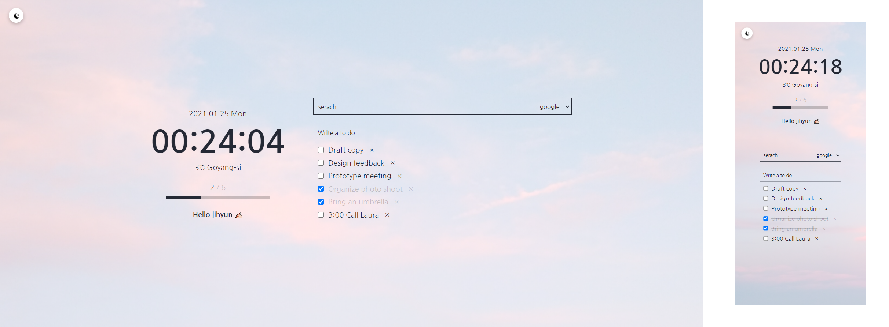
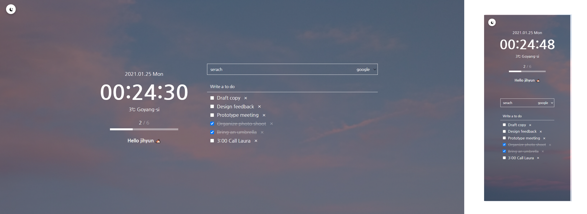

# todo-on-chrome
> 🔨 prototype   
> https://kimjihyunkr.github.io/todo-on-chrome/
   
#### 프로젝트 개요  
momentom 클론 프로젝트로, 바닐라 js를 사용하여 브라우저에 정보를 저장시켜 to do list를 관리한다.
   
#### 프로젝트 결과
   

* 다크모드를 사용할 수 있습니다.
* to do list의 달성 결과에따라 달성률을 보여줍니다.
* 반응형으로 제작했습니다.
* 사용자의 위치 정보를 받아 현재 알려줍니다.
* 배경화면은 총 3 가지로 리로드를 할 때마다 랜덤으로 바뀝니다.

